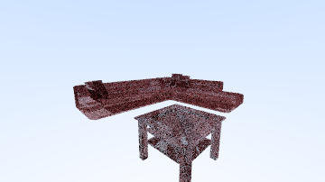
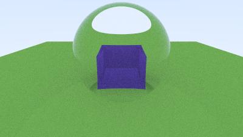
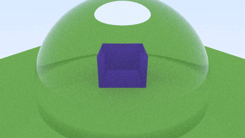

# :video_camera: Animating with Rays

Intending to apply the knowledge learned throughout the class, we rendered a short animation using raytracing. During the animation making, we tested different models to compose a scene. 

The initial idea was to render a simple living room, utilizing three polygon mesh models. However, that idea proved to be quite challenging and resource-consuming. Even the sample frames demanded a considerable amount of time to render. For this reason, this initial idea was discontinued based on the limited time for the project.

Instead of using polygon mesh models, we opted for something simpler and lighter to render. We composed the new scene with three objects: A floor, a Cube, and a semi-sphere dome. The floor and the cube were decomposed into a mesh of triangles, thus rendering each triangle separately.

As for the camera, we chose to animate a circular movement around the glass dome with the cube inside. Additionally, at the end of the animation, the camera pans to a distant view where we can observe the structure of the objects. At last, we compiled the rendered frames into the final animation.

